# maritime
A Comprehensive Approach to Real-Time Vessel Tracking, Historical Analysis, and Environmental Monitoring.

# Project Structure
- `src/ais-kafka-producer/`: Contains the AIS Kafka producer code that streams real-time vessel data to a Kafka topic. For it to work a `.env` file with necessary configurations is required, for example:
```env
TOPIC_NAME = "ais-stream"
BOOTSTRAP_SERVER = "kafka:29092"

API_KEY=<<API_KEY>>
BBOX="[[[-25.9973998712, 25.3439083708], [44.6049090453, 71.2982931893]]]" # Europe with Suez Canal
# BBOX="[[[-25.9973998712, 47.6517504467], [30.5839988025, 71.2828021422]]]" # North Europe
# BBOX="[[[-90, -180], [90, 180]]]" # Global
```

- `report`: Contains the project report in PDF format.
- `src/airflow/`: Contains the Airflow DAGs and configurations for orchestrating data processing tasks.
- `src/setup/`: Contains setup scripts and configuration files for the project environment.
- `src/docker-compose.yaml`: Docker Compose file to set up the entire environment including Kafka, Airflow, and other necessary services.
- `src/Makefile`: Makefile with commands to build, run, and manage the project components.

```mermaid
flowchart TD
    %% Top-down layout

    %% External Data Sources
    subgraph External["External Data Sources"]
        direction TB
        extAIS(["AIS Stream (WebSocket)"])
        extMarinesia(["Marinesia API (REST)"])
        extOpenMeteo(["Open Meteo API (REST)"])
    end

    %% Docker Compose Environment
    subgraph DockerCompose["Docker Compose Environment"]
        direction TB

        %% Orchestration
        subgraph Orchestration["Orchestration (Apache Airflow)"]
            Airflow(["Airflow Scheduler"])
        end

        %% Data Ingestion
        subgraph Ingestion["Data Ingestion Layer"]
            direction TB
            AIS(["AIS Downloader"])
            Kafka(["Kafka Broker"])
            
            %% Ingestion DAGs
            DAG1(["DAG 1: Marinesia Vessel/Port Info"])
            DAG2(["DAG 2: Open Meteo Forecast"])
            DAG2b(["DAG 5: Open Meteo Current Weather"])
            DAG4(["DAG 4: Kafka → HBase (Stream)"])
        end

        %% Analytics
        subgraph Analytics["Analytics & Reporting (Spark Jobs)"]
            direction TB
            Job1(["Storm Detection"])
            Job2(["Temperature Analysis"])
            Job3(["Ocean Current Analysis"])
            Job4(["Wave Type Comparison"])
            Job5(["Port Weather Summary"])
            Job6(["Fleet Composition"])
            Job7(["Port Characteristics"])
            Job8(["Traffic Density"])
        end

        %% Processing Resource
        subgraph Processing["Processing Resource"]
            Spark(["Apache Spark Cluster"])
        end

        %% Storage
        subgraph Storage["Storage Layer"]
            HDFS(["HDFS (Reports & Parquet)"])
            HBase(["HBase (Data Warehouse)"])
        end
    end

    %% External connections
    extAIS -->|WebSocket| AIS
    extMarinesia -->|Daily Fetch| DAG1
    extOpenMeteo -->|Hourly Fetch| DAG2
    extOpenMeteo -->|Hourly Fetch| DAG2b

    %% Real-time Ingestion Flow
    AIS -->|Push Event| Kafka
    Kafka -->|Consume| DAG4
    DAG4 -->|Write| HBase

    %% Batch Ingestion Flow
    DAG1 -->|Write| HBase
    DAG2 -->|Write| HBase
    DAG2b -->|Write| HBase

    %% Airflow Scheduling / Triggers
    Airflow -.->|Daily 00:00 UTC| DAG1
    Airflow -.->|Hourly| DAG2
    Airflow -.->|Hourly| DAG2b
    Airflow -.->|Continuous/Near real-time| DAG4
    
    %% Airflow triggering Analytics
    Airflow -.->|Scheduled Intervals| Job1
    Airflow -.->|Scheduled Intervals| Job2
    Airflow -.->|Scheduled Intervals| Job3
    Airflow -.->|Scheduled Intervals| Job4
    Airflow -.->|Scheduled Intervals| Job5
    Airflow -.->|Scheduled Intervals| Job6
    Airflow -.->|Scheduled Intervals| Job7
    Airflow -.->|Scheduled Intervals| Job8

    %% Analytics Processing Flow
    Analytics -.->|Submit Job| Spark
    
    %% Data Access for Analytics (Read HBase, Write HDFS)
    HBase -.-o|Read Data| Analytics
    Analytics -->|Save Reports| HDFS

    %% Storage Inter-relation
    HDFS <--> HBase

    %% Styling
    classDef external fill:#e0f7fa,stroke:#006064,stroke-width:2px;
    classDef ingestion fill:#fff3e0,stroke:#e65100,stroke-width:2px;
    classDef analytics fill:#e1bee7,stroke:#4a148c,stroke-width:2px;
    classDef storage fill:#e8f5e9,stroke:#1b5e20,stroke-width:2px;
    classDef processing fill:#f3e5f5,stroke:#4a148c,stroke-width:2px;
    classDef orchestration fill:#ffebee,stroke:#b71c1c,stroke-width:2px;

    class extAIS,extMarinesia,extOpenMeteo external;
    class AIS,Kafka,DAG1,DAG2,DAG2b,DAG4 ingestion;
    class Job1,Job2,Job3,Job4,Job5,Job6,Job7,Job8 analytics;
    class HDFS,HBase storage;
    class Spark processing;
    class Airflow orchestration;
    
```



# Getting Started

1. Clone the repository to your local machine.
2. Navigate to the `src/` directory.
3. Create a `.env` file in the `ais-kafka-producer` directory with the necessary configurations.
4. Use make commands to build and run the project components. For example:
   ```bash
    make up
   ```
5. Access the Airflow web interface at `http://localhost:8090` to monitor and manage your DAGs.
